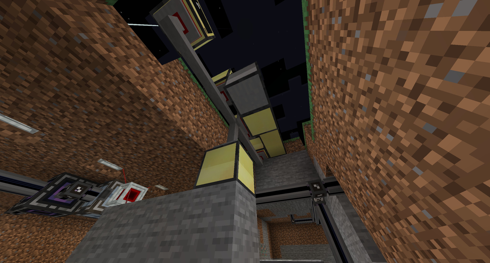
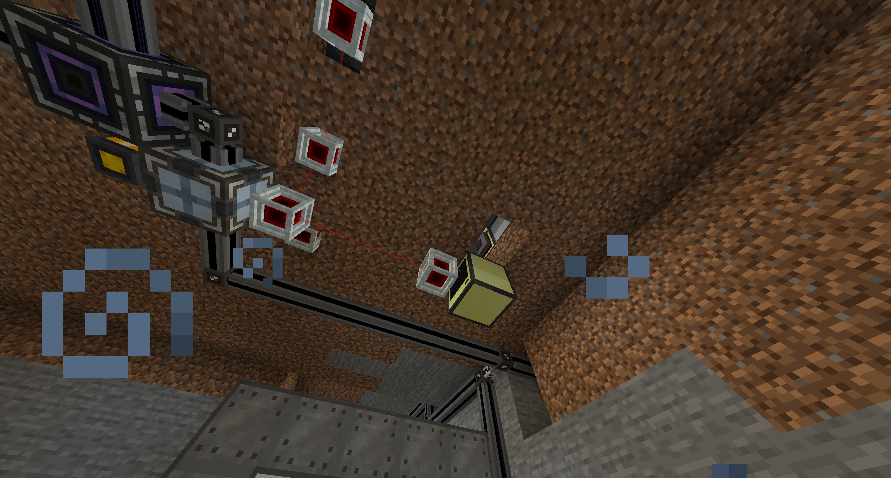

# Installation Instructions - Thermallilies

## Description
This collection of programs is used to make a fully-automated mana-generating setup for Botania using Thermalillies, along with a monitor for displaying the status of the lillies. Yes, I realized after coding all this that Thermalillies are very slow. I'm just proud of my first automation program.

## Installation
This setup is installed on a network of computers: one to output redstone, one for logging rednet broadcasts and displaying on the monitor, and as many as you want for reading the cooldown time of the lillies, one for each lily.

### Lily placement and redstone

To start, place your lillies at least one block apart, with a dispenser in the ground facing up next to each one:

Make sure you have a way of getting lava buckets into these dispensers, extracting empty buckets, and inputing a redstone signal. I used LaserIO's laser nodes to do all three from one side of the block! Behind each lily, place a redstone comparator and a single piece of redstone dust.
### Place and connect computers
No it's time to place the computers! place a computer next to each redstone dust, one below the ground, and one where you want to have your display. The code for the monitor is configured for a 4x2 screen, so you'll have to change some of the numbers in the code if you want to make a bigger screen.

To connect the computers, place a modem on the bottom side of each one next to the redstone, one on top of the underground computer, and one on the back of the monitor computer. Connect them with network cable, and right click each modem to connect it to the network! 

Note the computer ID numbers written in chat as you connect the computers, you'll need to edit the code based on what these IDs are. You can now configure your computers!

### Configure redstone readers

Get that floppy disk out, it's time to install!! Place a disk drive next to each computer that's touching the redstone from the lilies. Insert the floppy disk and run the commands

    cp disk/thermalillies/readRedstone.lua .
    cp disk/thermalillies/startup.lua .

That's it! They're ready to go after you reboot them.

### Configure redstone output computer
Now place the disk drive with the floppy next to the underground computer. run

    cp disk/thermalillies/postRedstone.lua .
    cp disk/thermalillies/startup.lua .

Here's where things get a bit hairy if you're new to coding. Get ready! you'll now want to run

    edit startup.lua

to edit the startup code. Look for each instance of the word "readRedstone", and change it to "postRedstone".
now hit ctrl, click save, then exit.

Next run

    edit postRedstone.lua

and recall the IDs of the readRedstone computers. You'll want to replace the code that says

    a[1] = 2
    a[2] = 4
    a[3] = 5
    a[4] = 6

with the IDs of your own computers. For instance, if your setup has computers 1, 3, 4, 5, and 8, you'll want to replace this code with

    a[1] = 1
    a[2] = 3
    a[3] = 4
    a[4] = 5
    a[5] = 8

Now scroll up to where it says

    function getId(tab,num)
        local ind = 0
        for i=1,4,1
            do
            if tab[i]==num then
                    ind = i
            end
        end
        return ind
    end

and change that 4 to whatever number of redstone reader computers you have. Down below, change the other 4 in the for loop

    for i=1,4,1 do
        id, message = rednet.receive()
        index = getId(a,id)
        print(message)
        b[i] = message
        table.remove(a,index)
        index = 0
    end

Finally, hook up redstone from the front of this computer over to the dispensers. Like I said earlier, I did this with some sweet laser nodes B)

That's all for the redstone poster, on to the display/listener computer!

### Configure the listener

The final step is to install the programs on the listener! This is the computer hooked up to the display. To do this, place down the disk drive next to it with the floppy inside, and run

    cp disk/thermalillies/listen.lua
    cp disk/thermalillies/restartSystem.lua

That's it! No funny business here. To start up the system, run

    restartSystem.lua

to tell all the computers to start running and boot up the display. You'll need to run this every time you log on, since the computers shut down when your world does.

### That's all!
Sit back and watch your lillies go to work. You earned the break! 

#### Known bug:
The display gets a bit buggy after it fills up the page and clears to start a new page. I'm currently working on fixing this.