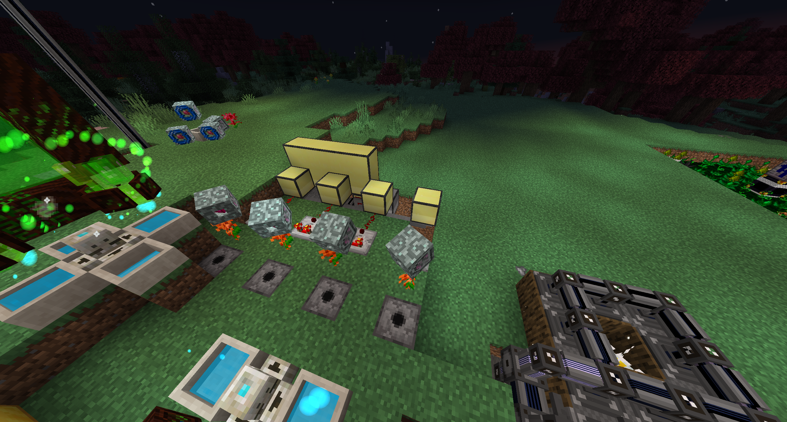

# Installation Instructions - Thermallilies

## Description
This collection of programs is used to make a fully-automated mana-generating setup for Botania using Thermalillies, along with a monitor for displaying the status of the lillies. Yes, I realized after coding all this that Thermalillies are very slow. I'm just proud of my first automation program.

## Installation
This setup is installed on a network of computers: one to output redstone, one for logging rednet broadcasts and displaying on the monitor, and as many as you want for reading the cooldown time of the lillies, one for each lily.

<ol>
<li> <h2>Lily placement and redstone</h2>
To start, place your lillies at least one block apart, with a dispenser in the ground facing up next to each one:

behind each 
</ol>